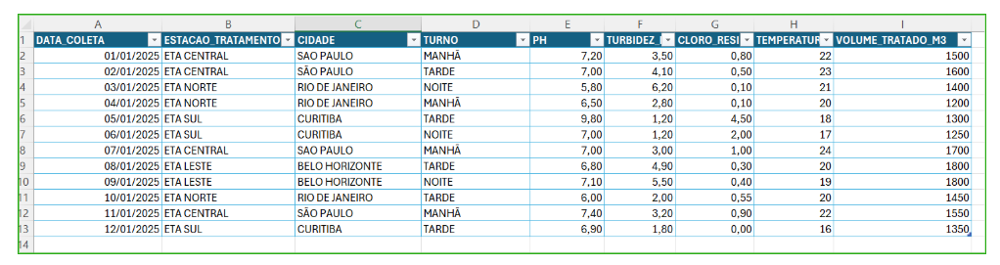

# 💧 Data Cleaning: Padronização de Dados de Tratamento de Água

Este repositório contém um projeto prático de Data Cleaning (Limpeza de Dados), onde transformei uma base de dados de tratamento de água bruta e desorganizada em uma estrutura organizada, padronizada e pronta para análise, utilizando Microsoft Excel.

## 📁 Estrutura do Projeto
1. csv/ base final limpa para visualização no GitHub
2. img/ base antes e depois da limpeza
3. pdf/ documento descrevendo o processo de limpeza
4. planilha_excel/ planilha com os dados originais e tratados

## 💻 O que foi realizado no tratamento:
1. Padronização de Texto: Uniformização das colunas de cidades, estações de tratamento e turnos.
2. Correção de Tipagem: Ajuste dos tipos de dados (datas e valores numéricos).
3. Ajuste de Casas Decimais: Padronização de valores como pH, turbidez e cloro residual.
4. Organização da Estrutura: Conversão da base em Tabela do Excel e organização das colunas.
5. Validação dos Dados: Conferência visual e lógica para garantir consistência.

## 🛠️ Tecnologias
Microsoft Excel: Limpeza, organização e formatação.
GitHub: Hospedagem e documentação do projeto.

## 📈 Comparação Visual
Abaixo, você pode ver a diferença entre a base bruta e a base tratada:
Antes (Dados Brutos)

Depois (Dados Limpos e Formatados)

